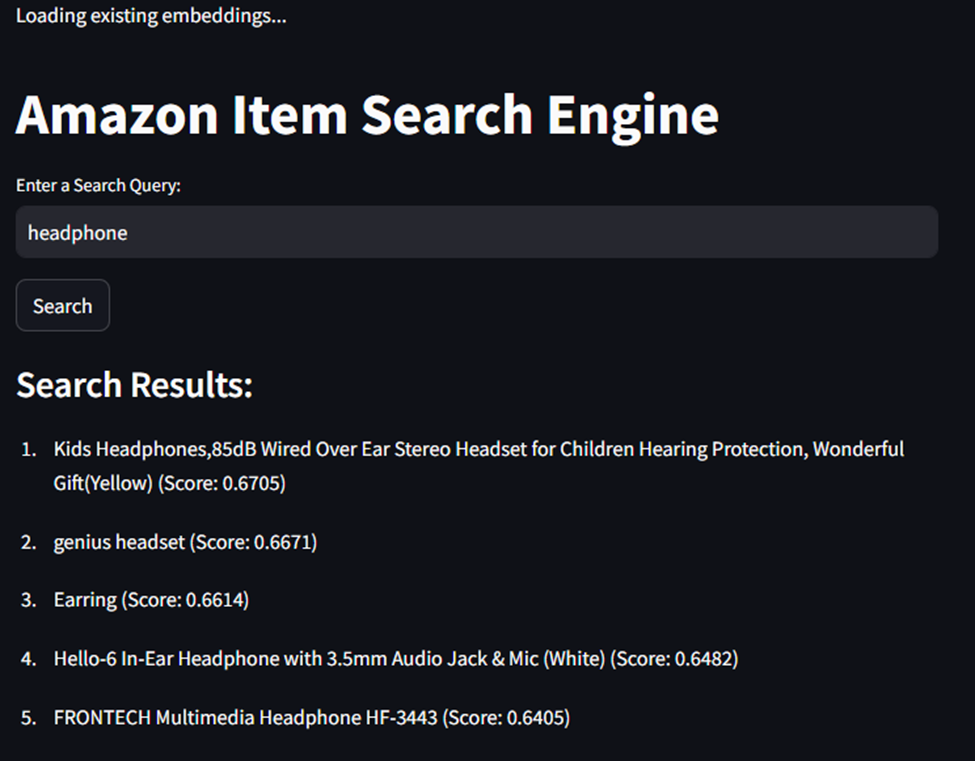

# Amazon Item Search Engine Deployment

## Goal:
The primary goal of this project was to deploy an Amazon product search engine using machine learning embeddings for fast, scalable search functionality. The system uses a dataset of Amazon product titles and leverages **txtai embeddings** to perform semantic search queries. I chose **Streamlit** for the deployment interface, allowing users to input search queries and retrieve results with high accuracy.

## Domain:
The app was deployed using Streamlit Cloud with the domain: https://search-engine-data-and-text-mining-as4.streamlit.app/ {try using it but it might give wrong result as it is scaled down version}

However, due to memory limitations with the large dataset, the deployment faced performance issues. As a result, it's recommended to run the app locally for better performance.

### Approach:

1. **Dataset**: 
   For the search engine, I used the **Amazon product training dataset** containing product titles. This dataset has over a million product entries, which provides a rich data source for training the search model. The dataset was uploaded to **Azure Blob Storage** due to the large file size (1.5GB), which could not be hosted on GitHub or typical cloud environments.

2. **Search Engine**:
   - **txtai**: This is the library that enables semantic search via embeddings. It uses a powerful pre-trained model to convert product titles into dense vectors and indexes them for search.
   - **Streamlit**: Streamlit was chosen for the user interface because of its ease of use and integration with Python. It allows users to search for products by entering queries, and the results are presented with similarity scores.

### Code Overview:

1. **`streamlit_app.py`**:
   - **Data Loading**: The `load_data` function loads the dataset (product titles) from a pre-configured Azure Blob Storage URL.
   - **Search Interface**: The app asks the user for a query, and when the user clicks 'Search', it queries the embeddings database to retrieve the top 5 most relevant product titles.
   - **Embedding Loading**: If the embeddings file already exists, it is loaded. Otherwise, an error is displayed, prompting the user to run the embedding process.

2. **`embedding.py`**:
   - **Embedding Creation**: In this script, the dataset is processed using a pre-trained sentence transformer model (`msmarco-distilbert-base-v4`). The product titles are embedded into high-dimensional vectors, indexed, and saved to a file for fast retrieval during searches.
   - **CUDA and PyTorch**: The script checks if a GPU is available for faster processing. It optimizes the number of threads used if running on a CPU.
## While using all-MiniLM-L6-v2 results not good


## While using msmarco-distilbert-base-v4 good result


### Key Components:
- **txtai**: Used for creating embeddings and indexing them for fast search.
- **Streamlit**: Creates a web-based interface for querying the search engine.
- **Azure Blob Storage**: Used to store the dataset and make it accessible for the app.

### Deployment Challenges:

1. **Azure Microservices**: Initially, I thought of using Azure Microservices for deployment, but the cost was prohibitive, and I encountered issues with serverless scaling that made the service unreliable for this use case.
2. **Streamlit Deployment**: I then used **Streamlit Cloud** for deployment. However, because the dataset (train.csv) is so large (1.5GB), uploading it through Git or Google Drive was not viable. I ended up using **Azure Blob Storage** to host the dataset, which works well for accessing the data.
3. **Out of Memory**: The size of the dataset is large enough that loading it into memory is causing crashes due to memory overload in the cloud environment. As a result, I recommend running this code locally.

### Local Setup Instructions:

1. **Clone this Repository**:
   Clone this project to your local machine using Git.

2. **Install Dependencies**:
   Use the following command to install the required dependencies:
   ```bash
   pip install -r requirements.txt
   ```

3. **Dataset**:
   - The `train.csv` dataset is hosted on **Azure Blob Storage**. Since it's too large to upload to Git or Google Drive, you need to download it from [Azure Blob Storage](<insert_link_to_blob_storage>).
   - After downloading, create a folder structure like this:
     ```bash
     project_root/
     ├── archive/
     │   └── dataset/
     │       └── train.csv
     ├── streamlit_app.py
     └── embedding.py
     ```

4. **Running the Application**:
   You can start the app locally using the following command:
   ```bash
   python -m streamlit run streamlit_app.py
   ```

### Notes:
- **Embeddings**: The embedding step is resource-intensive and requires a powerful GPU for optimal performance. However, since I have already created and stored the embeddings (`embeddings.db`), you can skip this step by directly loading the pre-created embeddings.
- **Azure Blob Storage**: I have uploaded the dataset for 7 days; after that, you will need to host it elsewhere or download it for local use.
- **Out of Memory Issue**: Due to the size of the dataset, if you're running the code on limited resources (e.g., Streamlit Cloud or other platforms), it might lead to crashes. I recommend running it locally or using a more powerful server to avoid these issues.

### Conclusion:

This project demonstrates how to use **txtai** embeddings and **Streamlit** to create an Amazon product search engine. It highlights the challenges faced when working with large datasets and the importance of selecting appropriate deployment environments. Although there are challenges with memory limitations in cloud-based environments, this app should run smoothly locally once the data is downloaded and set up correctly.